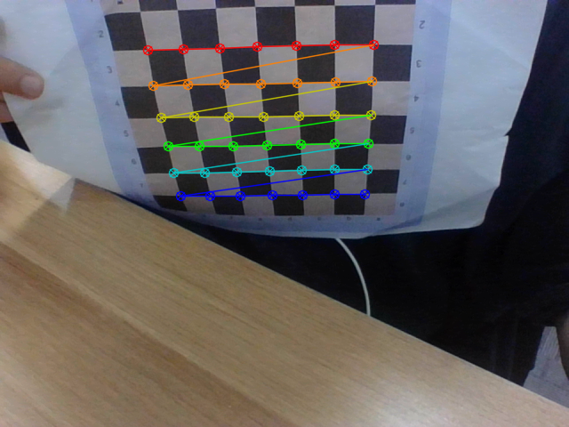
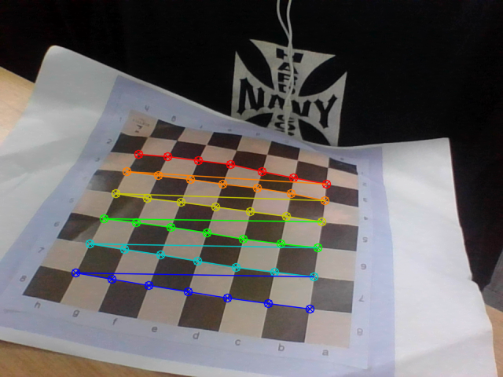

# Dự án: Hiệu chỉnh máy ảnh và tính khoảng cách đối tượng bằng OpenCV

## Mô tả dự án
Dự án này tập trung vào việc hiệu chỉnh máy ảnh và tính khoảng cách giữa các đối tượng bằng cách sử dụng OpenCV. Trong quá trình nghiên cứu và thử nghiệm, chúng tôi đã tổng hợp và mở rộng các phương pháp hiệu chỉnh camera, bao gồm cả việc xác định khoảng cách thông qua một hoặc hai camera.

## Quy trình thực hiện
### 1. Hiệu chỉnh máy ảnh
#### **Chạy file `1_camera_calibrate.py`**
- Mục tiêu của bước này là tính toán các ma trận quan trọng trong việc thiết lập hiệu chỉnh cho máy ảnh.
- Cần thu thập một tập hợp hình ảnh từ camera để sử dụng trong quá trình hiệu chỉnh.
- OpenCV được sử dụng để nhận diện mẫu lưới (chessboard) và tính toán các tham số nội tại của máy ảnh.

#### **Xác định tọa độ và vẽ đường tham chiếu**
- Sau khi hiệu chỉnh, các ảnh được thu thập sẽ được xử lý bằng OpenCV để vẽ các đường tọa độ.
- Mục tiêu là xác định vị trí và phục vụ cho việc tính toán hiệu chỉnh.

### 2. Tinh chỉnh ảnh đầu vào
Sau khi có các thông số hiệu chỉnh, chúng ta tiến hành các bước tinh chỉnh ảnh:
- **`Undistortion.py`**: Xử lý biến dạng hình ảnh do hiệu ứng quang học của camera.
- **`Disparity.py`**: Xác định độ chênh lệch giữa hai ảnh từ hai camera để hỗ trợ tính khoảng cách.
- **`Rectification.py`**: Căn chỉnh lại ảnh để hai ảnh từ hai camera có thể so sánh chính xác hơn.

Sau khi tinh chỉnh, ta có thể biết được độ lệch và các thông số cần thiết để tính toán khoảng cách.

### 3. Tích hợp với YOLOv8
Dự án kết hợp với mô hình YOLOv8 đã được huấn luyện với dữ liệu về hư hại đường bộ như:
- Ổ gà
- Vết nứt
- Các vấn đề hư hại khác trên mặt đường

Sau khi có thông tin hiệu chỉnh và tinh chỉnh ảnh, chúng ta tiến hành bước cuối cùng:

### 4. Chạy `2_run_all_calibrate.py`
- Đây là file tổng hợp tất cả các bước hiệu chỉnh.
- Tích hợp mô hình YOLOv8 để nhận diện hư hại đường bộ.
- Thực hiện xử lý đồng thời trên hai video (trái và phải) tại cùng một thời điểm.
- Áp dụng các thông số hiệu chỉnh để tính toán khoảng cách từ camera đến đối tượng nhận diện được.

## Kết luận
Dự án này giúp cải thiện khả năng đánh giá khoảng cách bằng cách sử dụng một hoặc hai camera, đồng thời kết hợp với mô hình học sâu để phát hiện các vấn đề trên mặt đường. Kết quả có thể được ứng dụng trong giám sát hạ tầng giao thông và các hệ thống tự động khác.

